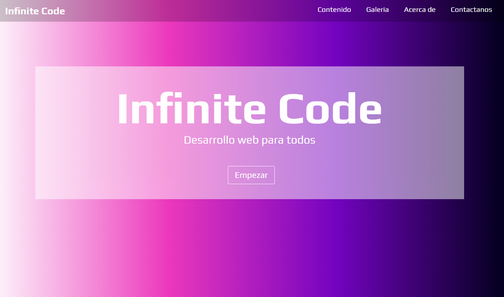
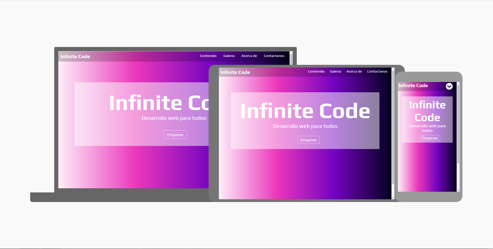

Portada de Sitio Web con Animate.css
---

Para el desarrollo del sitio utilizamos lo siguientes recursos:
---

1.	Lenguajes de programación (Html5 - Css3 - JavaScript)  
2.	Fuentes→ [Google Fonts](https://fonts.google.com/)
3.	Iconos → [Font aweson](https://fontawesome.com/)

Css3
---

4.	Flexbox → [Documentación de Flexbox ](https://www.w3schools.com/css/css3_flexbox.asp)
5.	Responsive Desing → [Documentación de Resposive Desing](https://www.w3schools.com/css/css_rwd_intro.asp)
6.	MediaQueries → [Documentación de MediaQueries](https://www.w3schools.com/css/css3_mediaqueries.asp)

Librería utilizida para la animación del menú 
---

**Animate.css**

Es una biblioteca de animaciones entre navegadores listas para usar en sus proyectos web. Excelente para enfatizar, páginas de inicio, controles deslizantes y sugerencias para guiar la atención.

**Instrucciones para Instalar y Utilizar → [Animate.css](https://animate.style/)**

Prueba de interfaz - Responsive Desing 
---

**Sitio web: Resizer [Entra aquí](https://material.io/resources/resizer/#url=https%3A%2F%2Fkeysel.github.io%2FInfiniteCode%2F) y prueba tus sitios responsive.**

